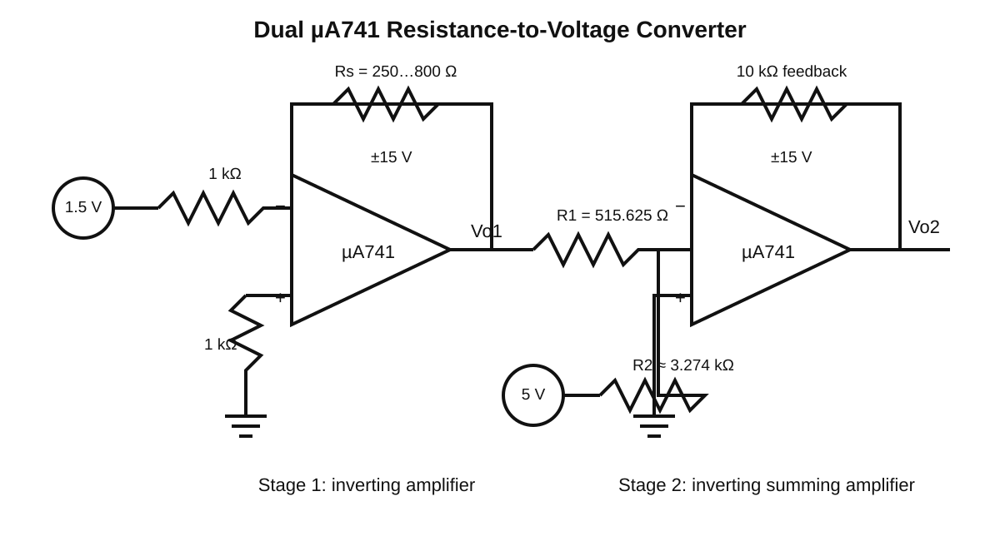

# Op-Amp Resistance-to-Voltage Converter

A dual-stage µA741 operational-amplifier circuit designed to convert a variable resistance into a calibrated output voltage. The design was derived analytically and verified using PSpice simulation.

## Project Goal

The circuit maps a sensor-like resistance range to a target output-voltage range:

| Input resistance | Target output |
| --- | ---: |
| Rs = 250 Ω | Vo2 = -8 V |
| Rs = 800 Ω | Vo2 = +8 V |

The design uses two µA741 op-amps powered from ±15 V supplies.

## Circuit Architecture



### Stage 1 — Inverting Amplifier

The first op-amp is configured as an inverting amplifier with:

- input resistor: 1 kΩ
- feedback resistor: Rs
- input source: Vs1 = 1.5 V

For the ideal-op-amp model:

```text
Vo1 = -(Rs / 1 kΩ) Vs1
```

Therefore:

- Rs = 250 Ω → Vo1 ≈ -0.375 V
- Rs = 800 Ω → Vo1 ≈ -1.200 V

### Stage 2 — Inverting Summing Amplifier

The second op-amp combines:

- Vo1 through R1
- Vs2 = 5 V through R2
- a 10 kΩ feedback resistor

Its ideal output is:

```text
Vo2 = -[(10 kΩ / R1) Vo1 + (10 kΩ / R2) Vs2]
```

Solving the two endpoint conditions gives:

```text
R1 = 515.625 Ω
R2 = 3273.8 Ω
```

The PSpice model uses approximately 3.274 kΩ for R2.

## Simulation Results

| Rs | Hand Vo1 | Simulation Vo1 | Hand Vo2 | Simulation Vo2 |
| ---: | ---: | ---: | ---: | ---: |
| 250 Ω | -0.375 V | -0.37505 V | -8.000 V | -7.996 V |
| 800 Ω | -1.200 V | -1.200 V | +8.000 V | +8.002 V |

The simulated values closely match the hand calculations.

See [RESULTS.md](RESULTS.md) for the detailed comparison.

## PSpice Files

The `pspice/` folder contains the sanitized text-based PSpice project files:

- `Figure.cir` — analysis setup and parameter sweep
- `Figure.net` — circuit netlist
- `Figure.als` — schematic aliases

The original simulation configures a DC sweep of the parameter `RS`.

## Repository Structure

```text
opamp-resistance-to-voltage-converter/
├── diagrams/
│   └── opamp-resistance-converter.svg
├── pspice/
│   ├── Figure.cir
│   ├── Figure.net
│   └── Figure.als
├── CALCULATIONS.md
├── RESULTS.md
├── README.md
├── .gitignore
└── LICENSE
```

## Tools & Concepts

- PSpice
- µA741 operational amplifiers
- Inverting amplifiers
- Summing amplifiers
- Ideal op-amp analysis
- Feedback networks
- DC sweep analysis
- Analog circuit design
- Hand calculation vs. simulation verification

## Course Context

**ENEE2360 — Analog Electronics Project**

The project focuses on analytical design followed by PSpice verification of an op-amp-based resistance-to-voltage conversion circuit.
